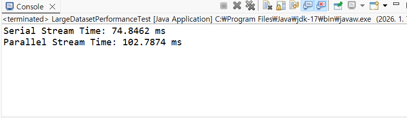
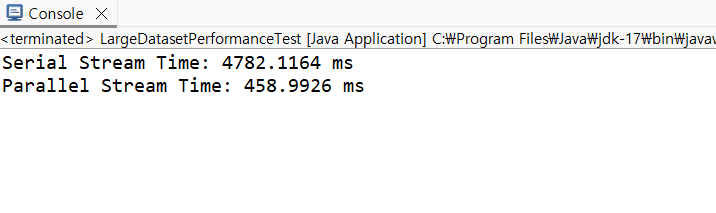
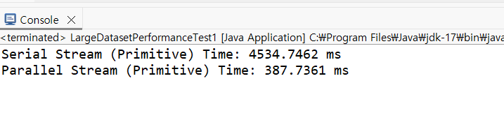

# Java-Stream
**<h1>Java-Stream API 사용 가이드 및 실측 보고서</h1>**


이 문서는 Java Stream API를 효율적이고 안전하게 사용하기 위한 7가지 핵심 원칙을 실습해보고 실습 결과를 다룹니다.


---

**<h2>? Stream API 사용 시 주의해야 할 7가지 </h2>**

**1. 재사용 불가능 (One-time Use)**: 종단 연산 후 스트림은 닫힙니다. 필요 시 다시 생성하세요.

**2. 무분별한 병렬 스트림 지양**: 스레드 관리 비용으로 인해 데이터가 적으면 오히려 느려질 수 있습니다.

**3. 부작용(Side Effect) 피하기**: 외부 변수 수정은 지양하고 collect()를 사용하세요. (실험 섹션 참고)

**4. 메서드 참조 활용**: 람다가 길어지면 메서드로 분리하여 가독성을 높이세요.

**5. 무한 스트림 주의**: iterate(), generate() 사용 시 반드시 limit()을 설정하세요.

**6. 박싱(Boxing) 오버헤드**: IntStream 등 기본형 스트림을 사용하여 성능을 최적화하세요.

**7. 전통적 Loop 고려**: 가독성과 성능 면에서 단순 for-loop가 유리할 때도 있습니다.


<h2> ? 실증 테스트 1: 연산의 복잡도와 병렬화의 상관관계 </h2>

**병렬 처리는 데이터를 쪼개고(Split) 합치는(Merge) 과정에서 오버헤드가 발생합니다.**

<h3>실험 과정</h3>
<h4>1. 가벼운 연산 : 100만 개 데이터에 대해 단순 제곱(n * n) 수행. </h4>

# Java-Stream

<h1>Java-Stream API 사용 가이드 및 실측 보고서</h1>

이 문서는 Java Stream API를 효율적이고 안전하게 사용하기 위한 7가지 핵심 원칙을 실습해보고 그 결과를 다룹니다.

---

<h2>? Stream API 사용 시 주의해야 할 7가지 </h2>

1. **재사용 불가능 (One-time Use)**: 종단 연산 후 스트림은 닫힙니다. 필요 시 다시 생성하세요.
2. **무분별한 병렬 스트림 지양**: 스레드 관리 비용으로 인해 데이터가 적으면 오히려 느려질 수 있습니다.
3. **부작용(Side Effect) 피하기**: 외부 변수 수정은 지양하고 `collect()`를 사용하세요. (실험 섹션 참고)
4. **메서드 참조 활용**: 람다가 길어지면 메서드로 분리하여 가독성을 높이세요.
5. **무한 스트림 주의**: `iterate()`, `generate()` 사용 시 반드시 `limit()`을 설정하세요.
6. **박싱(Boxing) 오버헤드**: `IntStream` 등 기본형 스트림을 사용하여 성능을 최적화하세요.
7. **전통적 Loop 고려**: 가독성과 성능 면에서 단순 for-loop가 유리할 때도 있습니다.

---

<h2> ? 실증 테스트 1: 연산의 복잡도와 병렬화의 상관관계 </h2>

**병렬 처리는 데이터를 쪼개고(Split) 합치는(Merge) 과정에서 오버헤드가 발생합니다.**


<h3>실험 과정</h3>

<h4>1. 가벼운 연산 : 100만 개 데이터에 대해 단순 제곱(n * n) 수행. </h4>

<details><summary>1번 실험 코드 펼치기/접기</summary>

```java
package lab02;

import java.util.List;
import java.util.stream.Collectors;
import java.util.stream.IntStream;

public class LargeDatasetPerformanceTest {

    public static void main(String[] args) {
        // 프로그램 실행 시 측정 메서드 호출
        measureLargeTask();
    }

    public static void measureLargeTask() {
        // 100만 개의 데이터 생성
        List<Integer> numbers = IntStream.rangeClosed(1, 1_000_000)
                                         .boxed()
                                         .collect(Collectors.toList());

        // [비교군] 직렬 스트림 실행 시간
        long startSerial = System.nanoTime();
        List<Integer> serialResult = numbers.stream()
                                            .map(n -> n * n)
                                            .collect(Collectors.toList());
        long endSerial = System.nanoTime();

        // [대조군] 병렬 스트림 실행 시간
        long startParallel = System.nanoTime();
        List<Integer> parallelResult = numbers.parallelStream()
                                              .map(n -> n * n)
                                              .collect(Collectors.toList());
        long endParallel = System.nanoTime();

        System.out.println("Serial Stream Time: " + (endSerial - startSerial) / 1_000_000.0 + " ms");
        System.out.println("Parallel Stream Time: " + (endParallel - startParallel) / 1_000_000.0 + " ms");
    }
}

```
</details>




<h4> 2. 무거운 연산 : 복잡한 수학 연산(Math.sqrt, sin, cos) 루프를 100회 추가 </h4>
 <details><summary>2번 실험 코드 펼치기/접기</summary>

``` java
package lab02;

import java.util.List;
import java.util.stream.Collectors;
import java.util.stream.IntStream;

public class LargeDatasetPerformanceTest {

    public static void main(String[] args) {
        measureLargeTask();
    }

    public static void measureLargeTask() {
        // 100만 개의 데이터 생성
        List<Integer> numbers = IntStream.rangeClosed(1, 1_000_000)
                                         .boxed()
                                         .collect(Collectors.toList());

        // [비교군] 직렬 스트림 실행 시간
        long startSerial = System.nanoTime();
        List<Double> serialResult = numbers.stream()
                                            // .map(n -> n * n) // 기존 가벼운 연산
                                            .map(LargeDatasetPerformanceTest::heavyCompute) // 무거운 연산 추가
                                            .collect(Collectors.toList());
        long endSerial = System.nanoTime();

        // [대조군] 병렬 스트림 실행 시간
        long startParallel = System.nanoTime();
        List<Double> parallelResult = numbers.parallelStream()
                                              // .map(n -> n * n) // 기존 가벼운 연산
                                              .map(LargeDatasetPerformanceTest::heavyCompute) // 무거운 연산 추가
                                              .collect(Collectors.toList());
        long endParallel = System.nanoTime();

        System.out.println("Serial Stream Time: " + (endSerial - startSerial) / 1_000_000.0 + " ms");
        System.out.println("Parallel Stream Time: " + (endParallel - startParallel) / 1_000_000.0 + " ms");
    }

    // CPU 부하를 시뮬레이션하기 위한 무거운 연산 메서드
    private static double heavyCompute(Integer n) {
        double result = 0;
        // 각 숫자마다 100번의 복잡한 수학 연산을 수행
        for (int i = 0; i < 100; i++) {
            result += Math.sqrt(Math.sin(i) * Math.cos(i) + Math.PI);
        }
        return result + n;
    }
}
```
</details>



결과: 무거운 연산에서는 병렬(Parallel) 스트림이 훨씬 효율적입니다.


**최종 요약**
- 데이터가 적거나 연산이 단순하면? 직렬 스트림 사용.

- 데이터가 많고 연산이 복잡하면? 병렬 스트림 고려.

---


<h3> 추가 실험 내용 </h3>
객체 생성 비용을 최소화하여 병렬 처리의 성능을 극대화하는 실험을 진행했습니다.

<h4>1. boxed() 메소드와 오버헤드</h4>
`boxed()` 메소드는 기본형 스트림(Primitive Stream)을 객체형 스트림(Object Stream)으로 변환합니다. Java의 `IntStream`, `LongStream` 등은 메모리 효율을 위해 기본형 데이터를 직접 다루지만, 일반 `Stream<Integer>`는 래퍼 클래스 객체로 감싸는 '박싱' 과정이 필요하며 이 과정에서 추가적인 자원이 소모됩니다.

<details> <summary>최적화 실험 코드 펼치기/접기</summary>

```java
package lab02;

import java.util.stream.IntStream;

public class LargeDatasetPerformanceTest1 {

    public static void main(String[] args) {
        measureLargeTask();
    }

    public static void measureLargeTask() {
        int size = 1_000_000;

        // [비교군] 직렬 기본형 스트림
        long startSerial = System.nanoTime();
        double serialSum = IntStream.rangeClosed(1, size)
                                    .mapToDouble(LargeDatasetPerformanceTest1::heavyCompute)
                                    .sum(); 
        long endSerial = System.nanoTime();

        // [대조군] 병렬 기본형 스트림
        long startParallel = System.nanoTime();
        double parallelSum = IntStream.rangeClosed(1, size)
                                      .parallel()
                                      .mapToDouble(LargeDatasetPerformanceTest1::heavyCompute)
                                      .sum();
        long endParallel = System.nanoTime();

        System.out.println("Serial Stream (Primitive) Time: " + (endSerial - startSerial) / 1_000_000.0 + " ms");
        System.out.println("Parallel Stream (Primitive) Time: " + (endParallel - startParallel) / 1_000_000.0 + " ms");
    }

    private static double heavyCompute(int n) {
        double result = 0;
        for (int i = 0; i < 100; i++) {
            result += Math.sqrt(Math.sin(i) * Math.cos(i) + Math.PI);
        }
        return result + n;
    }
}
```

</details>



---

<h3>3. 실험 결과 및 분석</h3>

**분석**: 기본형 스트림을 사용함으로써 객체 생성 및 관리 오버헤드를 줄였고, 병렬 처리 시 코어의 연산 능력을 더욱 순수하게 활용할 수 있었습니다.

**이유**: parallelStream()은 스레드 생성, 데이터 분할(Split), 결과 합치기(Combine) 과정에서 자원(Overhead)이 소모됩니다. 따라서 연산 자체가 매우 가벼우면 병렬화 준비 시간이 더 길어질 수 있으나, 본 실험처럼 무거운 연산과 기본형 스트림이 결합될 때 최적의 성능을 냅니다.

---

# 중간 연산자 과다 사용 문제

## 📋 개요

Java Stream API에서 `filter()`, `map()` 같은 중간 연산자를 과도하게 분리하면 각 stage를 통과할 때마다 람다 호출 오버헤드가 누적되어 성능 저하가 발생할 수 있다.

## 🔍 문제점

Stream 파이프라인에서 중간 연산자를 과도하게 분리하면, **각 연산 단계(stage)를 통과할 때마다 Predicate나 Function과 같은 람다 표현식이 추가로 호출**된다. 
이로 인해 단일 요소가 **파이프라인**을 지나가는 동안 수행되는 함수 호출 횟수가 증가하고, 그에 따른 **호출 오버헤드가 누적**되어 전체 처리 성능이 저하될 수 있다. 
또한 파이프라인 단계 수가 불필요하게 많아지면, **JVM**이 연산 흐름을 단순화하거나 람다를 인라이닝하는 등의 최적화를 적용하기 어려워져, 결과적으로 실행 성능 개선을 위한 **최적화 기회가 감소**하는 문제가 발생한다.

### 예시: 과도하게 분리된 파이프라인

```java
names.stream()
    .filter(name -> name.startsWith("A"))      // stage 1
    .filter(name -> name.length() > 3)          // stage 2
    .map(String::toUpperCase)                   // stage 3
    .map(name -> name + " is a name")           // stage 4
    .collect(Collectors.toList());
```

## ✅ 솔루션: Stage 수 줄이기

### 최적화 전략

1. **Filter 결합**: 여러 `filter()` 호출을 하나로 병합 (`&&` 연산자 사용)
2. **Map 결합**: 연속된 `map()` 호출을 하나로 병합
3. **람다 호출 횟수 감소**: Stage 수가 줄면 람다 호출 횟수가 감소
4. **JVM 최적화**: 인라이닝 및 파이프라인 최적화에 유리

### 최적화된 코드

```java
names.stream()
    .filter(name -> name.startsWith("A") && name.length() > 3)
    .map(name -> name.toUpperCase() + " is a name")
    .collect(Collectors.toList());
```

## 🧪 실험 설정

### 테스트 환경

- **데이터 크기**: 5,000,000 / 100,000,000 건
- **Warmup 횟수**: 5회
- **측정 횟수**: 10회 (최소값 기준)
- **측정 방법**: Best time of multiple runs

### JVM Warm-up의 필요성

JVM은 **Just-In-Time(JIT) 컴파일러**를 사용하여 자주 실행되는 바이트코드를 런타임 중에 **네이티브 코드로 변환**하고 최적화한다. 
이 과정은 프로그램이 실행되면서 점진적으로 이루어지기 때문에, **실행 초반에는 인터프리터 기반 실행의 비중이 높**고 인라이닝, 루프 최적화, 분기 예측 개선과 같은 고급 **최적화가 아직 충분히 적용되지 않은 상태**이다. 
따라서 프로그램 시작 직후의 실행 결과는 JVM이 충분히 워밍업된 이후의 실제 성능을 정확하게 반영하지 못할 가능성이 크며, 신뢰할 수 있는 성능 측정을 위해서는 일정 횟수의 반복 실행을 통한 JVM 워밍업 과정이 필요하다.


#### Warm-up 코드

```java
// JVM warmup (important)
for (int i = 0; i < 5; i++) {
    version1(names);
    version2(names);
}
```

**목적:**
- 두 구현(version1, version2)을 동일 횟수로 사전 실행
- JIT 컴파일러가 Stream 파이프라인을 충분히 관찰하도록 유도
- 람다 표현식, 메서드 참조, 조건 분기 코드에 대해 최적화 적용

## 📊 실험 결과

### 데이터 크기: 5,000,000 건

| Version | 실행 시간 | 설명 |
|---------|----------|------|
| Version 1 (more stages) | 47.4147 ms | 여러 filter/map 사용 |
| Version 2 (fewer stages) | 74.7858 ms | 결합된 filter/map 사용 |

⚠️ **주의**: 작은 데이터에서는 결합 조건식(`&&`)이 오히려 불리하거나, 측정 노이즈/환경 영향이 클 수 있음

### 데이터 크기: 100,000,000 건

| Version | 실행 시간 (1차) | 실행 시간 (2차) |
|---------|----------------|----------------|
| Version 1 (more stages) | 3866.1665 ms | 9846.0332 ms |
| Version 2 (fewer stages) | 2152.7165 ms | 2223.2132 ms |

✅ **결론**: 데이터가 커질수록 stage 축소 효과가 크게 나타남

## 📈 성능에 영향을 주는 요인

### 1. Short-Circuit 동작 (단락 평가)

```java
// A && B: A가 false면 B는 평가하지 않음
name.startsWith("A") && name.length() > 3

// A || B: A가 true면 B는 평가하지 않음
name.isEmpty() || name.startsWith("A")
```

**최적화 팁**: 비싼 조건을 뒤로 보내는 것이 일반적으로 유리

### 2. 조건의 선별력 (Selectivity)

빨리 많은 원소를 걸러내는 조건을 먼저 두면 이후 연산이 줄어듦

```java
// 좋은 예: 선별력이 높은 조건을 먼저
.filter(name -> name.length() > 3 && name.startsWith("A"))

// 나쁜 예: 선별력이 낮은 조건을 먼저
.filter(name -> name.startsWith("A") && name.length() > 3)
```

### 3. 분기 예측 및 CPU 파이프라인

조건 결과가 불규칙하면 CPU의 분기 예측 실패가 늘어나 성능에 영향을 줄 수 있음

## 🔬 실험 코드

<details>
<summary>전체 코드 보기</summary>

```java
package lab02;

import java.util.*;
import java.util.concurrent.TimeUnit;
import java.util.stream.Collectors;

/**
 * Problem: Overuse of intermediate operations (too many stages)
 * 
 * Solution: Reduce the number of stages
 * - Each stage introduces additional Predicate/Function calls.
 * - Fewer stages may reduce lambda invocation overhead and pipeline traversal cost.
 * 
 * Note:
 * - Combining predicates with && / || can affect performance due to short-circuiting
 *   and branch prediction behavior.
 */
public class OveruseOperations04 {

    static final int SIZE = 5_000_000;
    static final int WARMUP = 5;
    static final int RUNS = 10;
    static volatile int blackhole;

    public static void main(String[] args) {
        List<String> names = generateData(SIZE);

        // Sanity check
        List<String> r1 = version1(names);
        List<String> r2 = version2(names);
        if (!r1.equals(r2)) {
            throw new IllegalStateException("Results differ between version1 and version2!");
        }

        // JVM warmup
        for (int i = 0; i < WARMUP; i++) {
            consume(version1(names));
            consume(version2(names));
            consume(version2_conditionOrder(names));
        }

        // Measure
        long bestV1 = measureBestNanos(() -> consume(version1(names)), RUNS);
        long bestV2 = measureBestNanos(() -> consume(version2(names)), RUNS);
        long bestV2Order = measureBestNanos(() -> consume(version2_conditionOrder(names)), RUNS);

        System.out.println("=== Data size: " + SIZE + " ===");
        System.out.printf("Version 1 (more stages) best: %.3f ms%n", nanosToMs(bestV1));
        System.out.printf("Version 2 (fewer stages) best: %.3f ms%n", nanosToMs(bestV2));
        System.out.printf("Version 2 (condition order) best: %.3f ms%n", nanosToMs(bestV2Order));
    }

    /** Version 1: more stages */
    static List<String> version1(List<String> names) {
        return names.stream()
            .filter(name -> name.startsWith("A"))
            .filter(name -> name.length() > 3)
            .map(String::toUpperCase)
            .map(name -> name + " is a name")
            .collect(Collectors.toList());
    }

    /** Version 2: fewer stages */
    static List<String> version2(List<String> names) {
        return names.stream()
            .filter(name -> name.startsWith("A") && name.length() > 3)
            .map(name -> name.toUpperCase() + " is a name")
            .collect(Collectors.toList());
    }

    /** Version 2: condition order experiment */
    static List<String> version2_conditionOrder(List<String> names) {
        return names.stream()
            .filter(name -> name.length() > 3 && name.startsWith("A"))
            .map(name -> name.toUpperCase() + " is a name")
            .collect(Collectors.toList());
    }

    static long measureBestNanos(Runnable task, int runs) {
        long best = Long.MAX_VALUE;
        for (int i = 0; i < runs; i++) {
            long start = System.nanoTime();
            task.run();
            long end = System.nanoTime();
            best = Math.min(best, end - start);
        }
        return best;
    }

    static double nanosToMs(long nanos) {
        return nanos / 1_000_000.0;
    }

    static void consume(List<String> list) {
        blackhole ^= list.size();
        if (!list.isEmpty()) {
            blackhole ^= list.get(0).hashCode();
        }
    }

    static List<String> generateData(int size) {
        List<String> list = new ArrayList<>(size);
        Random r = new Random(42);
        for (int i = 0; i < size; i++) {
            char first = (i % 10 == 0) ? 'A' : (char) ('B' + r.nextInt(24));
            list.add(first + randomWord(r, 3 + r.nextInt(8)));
        }
        return list;
    }

    static String randomWord(Random r, int len) {
        StringBuilder sb = new StringBuilder(len);
        for (int i = 0; i < len; i++) {
            sb.append((char) ('a' + r.nextInt(26)));
        }
        return sb.toString();
    }
}
```

</details>

## 💡 결론

데이터 크기가 비교적 **작은 경우**(약 5M 수준)에는 측정 결과의 편차가 크게 나타날 수 있다. 이 구간에서는 JVM의 JIT 최적화 진행 상태, 실험 시점의 CPU 부하, 운영체제 스케줄링 간섭 등 외부 요인의 영향이 커지며, 이로 인해 실험 결과가 일관되지 않거나 경우에 따라 성능 우위가 뒤바뀌는 현상이 발생할 수 있다. 즉, 이 규모에서는 Stream 파이프라인의 **stage 수 차이보다 런타임 환경 요소가 성능에 미치는 영향이 더 크게 작용**할 가능성이 있다.

반면 데이터 크기가 충분히 **큰 경우**(약 100M 수준)에는 Stream 파이프라인 구조 차이에 따른 성능 영향이 누적되어 보다 명확한 결과가 관찰된다. 중간 연산자(stage) 수가 많을수록 람다 호출 횟수와 파이프라인 traversal 비용이 반복적으로 발생하며, 이러한 오버헤드는 대규모 데이터 처리 과정에서 누적된다. 그 결과 stage 수를 줄인 구현 방식에서는 **람다 호출 오버헤드와 파이프라인 비용이 감소**하여, 두 구현 간 성능 차이가 뚜렷하게 나타난다.

또한 조건 결합 방식 역시 성능에 중요한 영향을 미칠 수 있다. **`&&`, `||` 연산자**는 단락 평가(short-circuit) 특성을 가지므로 조건의 평가 순서에 따라 실제 실행되는 연산 횟수가 달라진다. 일반적으로 평가 비용이 낮거나 빠르게 false 또는 true가 결정될 가능성이 높은 조건을 앞에 배치할수록 불필요한 조건 평가를 줄일 수 있어 성능 측면에서 유리하다. 따라서 조건을 단순히 결합하는 것만으로 최적화가 보장되는 것은 아니며, 각 조건의 비용과 실패 확률을 고려한 순서 설계가 필요하다.


## 📚 참고 자료

- [Java Stream API Documentation](https://docs.oracle.com/javase/8/docs/api/java/util/stream/package-summary.html)
---

**Last Updated**: 2026-01-12
